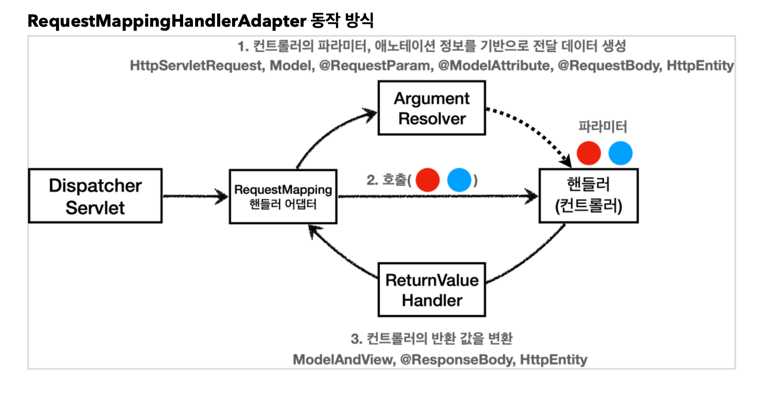
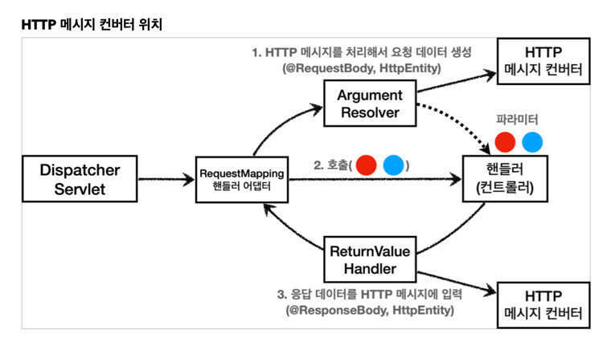

# Spring MVC (Part 1)

- Spring Boot `v2.6.7`
- kotlin `v1.6.21`

---

### logging
* log-level
  * trace
  * debug: 개발 서버
  * info: 운영 서버
  * warn
  * error

---
### 요청 매핑
@Controller: 반환 값이 String이면, view를 찾고 랜더링 \
@RestController: 반환 값이 String이면, Http 메세지 body에 바로 입력

---
### 요청 매핑 핸들러 어댑터 구조

애노테이션 기반 컨트롤러를 처리하는 RequestMappingHandlerAdaptor 는 ArgumentResolver 를 호출해서 
컨트롤러(핸들러)가 필요로 하는 다양한 파라미터의 값(객체)을 생성한다. 
그리고 이렇게 파리미터의 값이 모두 준비되면 컨트롤러를 호출하면서 값을 넘겨준다.

ArgumentResolver의 supportsParameter() 를 호출해서 해당 파라미터의 지원여부를 확인하고,
지원 가능하면 resolveArgument() 를 호출해서 실제 객체를 생성해준다. 
이후 컨트롤러에 해당 객체를 넘긴다.

---
### ReturnValueHandler (HandlerMethodReturnValueHandler)
응답값을 변환하고 처리

---
### HTTP 메시지 컨버터 위치

---

### 확장
스프링은 아래 기능을 모두 인터페이스로 제공 (언제든 확장 가능)
* HandlerMethodArgumentResolver
* HandlerMethodReturnValueHandler
* HttpMessageConverter